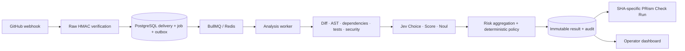

# PRism

**AI-assisted Pull Request Risk & Merge Governance Platform**

Know the risk before you merge. PRism turns repository evidence, TypeSafe Jev judgment and versioned policy into a SHA-bound GitHub check: **SAFE**, **REVIEW** or **BLOCK**.

The local MVP is implemented and verified. Live GitHub App installation, Jev responses and required-check enforcement remain **unverified** until real credentials and a test repository are configured. The public demo is a labeled synthetic replay of the same analysis engine.



## Try the local demo

Use Node 22 and pnpm 10.34.4. The lockfile pins the installed dependency versions.

```sh
pnpm install --frozen-lockfile
pnpm dev:demo
```

Open **http://localhost:3000/demo**. No GitHub credentials, Jev key or database is needed for this fixture workspace. Demo mutations are rejected by the server.

The dashboard shows computed decisions, eight risk categories, located evidence, redacted diffs, graph selection, commit snapshots and provider limitations. Its health score is `100 − mean analyzed risk`, not a calibrated safety probability. Counts represent analyzed snapshots, not a live inventory of open GitHub PRs.

## Run the real local services

```sh
cp .env.example .env
docker compose up -d --wait
pnpm db:migrate
```

Configure `.env` using the [GitHub App setup guide](docs/github-app-setup.md). Set a dashboard password of at least 16 characters and a webhook signing secret of at least 24 characters. Keep the RSA private key in a local file outside the repository. Then run web and services in separate terminals:

```sh
pnpm dev
pnpm dev:services
```

Webhook endpoint: `/api/github/webhooks` on port 3001. Liveness: `/health/live`; database readiness: `/health/ready`. The webhook process does not need the App private key; the worker does not need the signing secret. Without a Jev key, the default policy requires review.

The default policy requires explicitly named CI checks. An empty required-check list does **not** authorize SAFE. Configure repository policy through `/settings/policy` after installation. A validated [policy example](config/policy.example.yaml) is included.

## Verify

```sh
pnpm lint
pnpm --filter @prism/web exec next typegen
pnpm typecheck
pnpm test
pnpm test:integration
pnpm evaluate
pnpm build
pnpm exec playwright install chromium
pnpm test:e2e
```

Integration and browser tests require local PostgreSQL and Redis. Tests create isolated schemas and remove them afterward. Browser checks use the production build on ports 3100 and 3101, including real database-backed policy saves, feedback and outbox insertion. CI runs the same checks for each PR and merge group.

The seven golden cases evaluate deterministic policy regressions without model calls; they are **not** a measure of live AI accuracy. See [evaluation and validation boundaries](docs/evaluation.md).

## CLI

```sh
pnpm prism help
pnpm prism policy validate config/policy.example.yaml
pnpm prism analyze snapshot.json policy.json
pnpm prism explain analysis.json
pnpm prism sarif analysis.json
pnpm prism calibrate observations.json
pnpm prism enqueue owner/repo 123
```

Snapshot analysis and the backend share the same engine. Analyze exits with 0 for SAFE, 2 for BLOCK and 3 for REVIEW; invalid input or service failure exits with 1. `enqueue` requires `GITHUB_APP_ID`, `GITHUB_PRIVATE_KEY_PATH`, `GITHUB_INSTALLATION_ID`, `GITHUB_REPOSITORY_ID` and `DATABASE_URL`; it persists a new job for the worker using a repository-scoped installation token.

## Structure and boundaries

| Location | Responsibility |
| --- | --- |
| `apps/github-app` | Signature verification and durable webhook acceptance |
| `apps/worker` | Outbox relay, bounded queue concurrency and publication retries |
| `apps/web` | Next.js 16 / React 19 operator UI, FSD import checks and protected APIs |
| `apps/cli` | Shared-engine local analysis and live enqueue |
| `packages/domain`, `policy`, `risk-engine` | Typed contracts and deterministic decisions |
| `packages/parser`, `analysis`, `security` | JS/TS AST, module/test impact, security heuristics and SARIF |
| `packages/github`, `judge`, `database`, `observability` | GitHub App, TypeSafe, PostgreSQL and OTLP adapters |
| `evaluation/cases`, `tests` | Labeled fixtures, contract tests and real service/browser checks |

The service never runs analyzed repository code. Jev receives bounded analyzer facts, without source, diff, filenames, repository prose or credential values. Deterministic security, critical-path tests and required CI can block independently of the model. REVIEW maps to `action_required`, so it does not pass a required check.

JS/TS syntax analysis and relative-import graphs are implemented. Whole-program type/dataflow analysis, executed coverage collection, additional language parsers, automatic incident/revert inference, organization policies and permissioned overrides remain future work. Partial collection and unsupported source languages produce visible limitations and conservative decisions. SARIF import/export is implemented; external scanner execution is not part of this service.

## Operations

```sh
docker build -t prism:local .
docker run --rm -p 127.0.0.1:3000:3000 -e PRISM_DEMO=true prism:local
```

The image runs as UID 1000 and includes the source/toolchain needed by workspace TS exports. For a real installation, deploy web, webhook and worker separately, provide credentials at runtime, mount the key read-only, and use private PostgreSQL/Redis plus a TLS reverse proxy. Development Compose credentials and loopback ports are for local use. See the [security and operations model](docs/security-operations.md), [ADR](docs/adr/0001-evidence-first-governance.md) and [official-source research](docs/research/official-sources.md).

Implementation is delivered as one functional commit per PR, with review and passing CI before merge. Live acceptance is tracked separately in the setup guide.
